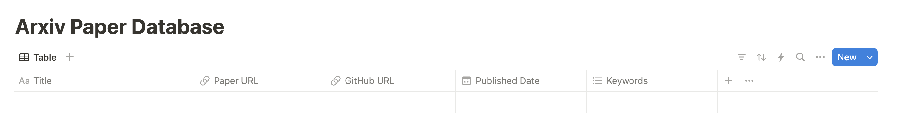

# arxiv-paper-fetcher

arxivから論文を取得してNotionに保存するスクリプト

## 使い方

### 0. Notion の設定
- Notion Integration を設定する
- データベースを作成する


### 1. 環境変数の設定

`.env`ファイルを作成して以下のように環境変数を設定します。
```.env
NOTION_TOKEN=your_notion_token
NOTION_DATABASE_ID=your_notion_database_id
```

### 2. ライブラリのインストール

```bash
uv sync
```

### 3. スクリプトの実行

```bash
uv run arxiv_paper_fetcher.py
```
